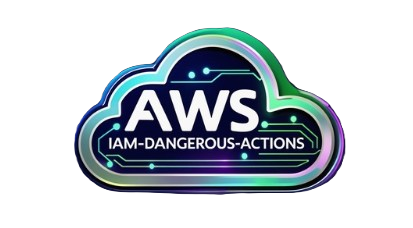
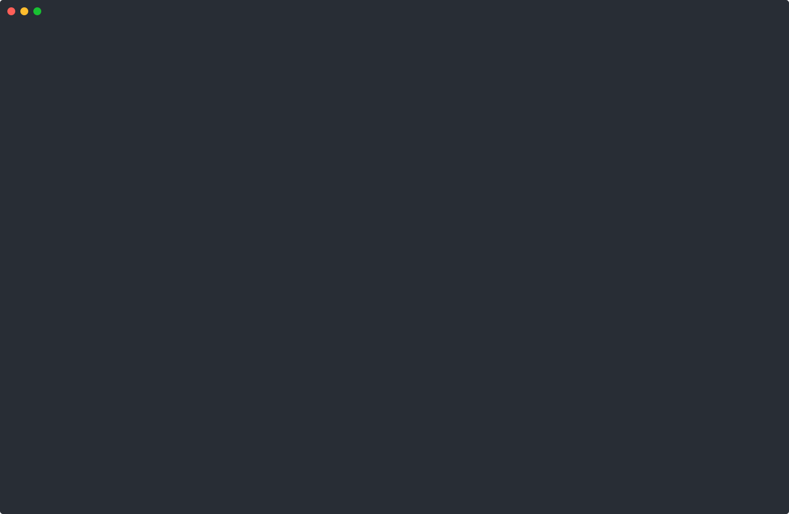

<p align="center">
  
</p>

# iam-dangerous-actions


## Table of Contents

1. [Problem Statement](#Problem-Statement)
2. [What is iam-dangerous-actions](#What-is-iam-dangerous-actions)
3. [Real-world use cases](#Real-world-use-cases)
4. [How are risks assigned to IAM actions?](#How-are-security-risks-assigned-to-iam-actions)
5. [Available-formats](#Available-formats)
6. [List of current AWS services](#List-of-current-AWS-services)
7. [Total number of iam-dangerous-actions](#Total-number-of-iam-dangerous-actions)
8. [How is this different from other IAM tools?](#How-is-this-different-from-other-IAM-tools)
9. [Who is this for?](#Who-is-this-for)
10. [Exclusions](#Exclusions)
11. [What is the difference between dangerous and high privilege IAM actions?](#What-is-the-difference-between-dangerous-and-high-privilege-IAM-actions)
12. [Future plans](#Future-plans)
13. [Contributions and feedback](#Contributions-and-feedback)
14. [Acknowledgements](#Acknowledgements) 

<br />


## Problem Statement

One of the most effective ways to secure an AWS account — and, by extension, the organisation as a whole — is to minimise security threats and attack vectors, whether they are internal or external.

The next logical step is to implement the least-privilege principle for IAM roles and permission sets in a well-configured manner.

This [introduction](https://github.com/ZiyadAlmbasher/iam-dangerous-actions/blob/main/documentations/introduction.md) explains some of the challenges with IAM and the reasoning behind creating ```iam-dangerous-actions```, which aims to **"Find Your Dangerous IAM Roles, Fast!"**

<br />


## What is ```iam-dangerous-actions```? 

A **list** of hand-picked **dangerous** IAM actions that, if used with malicious intent, or assigned carelessly, can lead to the following security risks:

1. AWS privilege escalation (PE)
2. Evasion or Disabling of security controls (DC)
3. Data Exfiltration (DE)
4. Hiding one's tracks (HT)


Each of the ```iam-dangerous-actions``` is  assigned to one or more of the security risks listed above. The process by which these security risks are assigned to each IAM action is [explained here](https://github.com/ZiyadAlmbasher/iam-dangerous-actions/blob/main/documentations/how-are-risks-assigned.md).  


The ```iam-dangerous-actions``` list is available in different [formats](#Available-formats) (or sub-lists), for various [real-world use cases](#Real-world-use-cases).


<br />

## Real-world use cases

There are currently 3 [real-world use cases](https://github.com/ZiyadAlmbasher/iam-dangerous-actions/blob/main/documentations/real-world-use-cases.md) to explore some of the capabilities of ```iam-dangerous-actions```.


Here's a quick demo for "[Checking which IAM policies are dangerous](https://github.com/ZiyadAlmbasher/iam-dangerous-actions/blob/main/documentations/real-world-use-cases.md#scenario-3-checking-which-iam-policies-are-dangerous)":


<!-- Image of test1.svg -->




<br />

## How are security risks assigned to IAM actions? 
Here's a detailed [overview](https://github.com/ZiyadAlmbasher/iam-dangerous-actions/blob/main/documentations/how-are-risks-assigned.md).

<br />


## Available formats

```iam-dangerous-actions``` is available in different formats (or, sublists): 

1. A single [list](https://github.com/ZiyadAlmbasher/iam-dangerous-actions/blob/main/lists/iam-dangerous-actions.txt) with **all** the dangerous IAM actions. This list available as a text file.  

2. A single [list](https://github.com/ZiyadAlmbasher/iam-dangerous-actions/blob/main/lists/iam-actions-all-risks.txt) containing **all** the dangerous IAM actions, where each IAM action is categorised by all the **security risks** combined. This list is available as a text file.

3. A single [list](https://github.com/ZiyadAlmbasher/iam-dangerous-actions/blob/main/lists/explicit-deny-all-actions.txt) of multiple **explicit-deny**  IAM policies. These explicit-deny IAM policies are split to fit IAM policy size limits, and they collectively contain **all** the dangerous IAM actions. The IAM policies are available in JSON format. 

4. Multiple different lists of dangerous IAM actions. **Each** individual list is categorised by a **single security risk**: [PE](https://github.com/ZiyadAlmbasher/iam-dangerous-actions/blob/main/lists/iam-actions-PE-risk.txt), [DC](https://github.com/ZiyadAlmbasher/iam-dangerous-actions/blob/main/lists/iam-actions-DC-risk.txt), [DE](https://github.com/ZiyadAlmbasher/iam-dangerous-actions/blob/main/lists/iam-actions-DE-risk.txt) and [HT](https://github.com/ZiyadAlmbasher/iam-dangerous-actions/blob/main/lists/iam-actions-HT-risk.txt). These lists are available as text files.


5. Multiple **explicit-deny** IAM policies. **Each** individual explicit-deny IAM policy is categorised by a **single security risk**: [PE](https://github.com/ZiyadAlmbasher/iam-dangerous-actions/blob/main/lists/explicit-deny-PE-risk.txt), [DC](https://github.com/ZiyadAlmbasher/iam-dangerous-actions/blob/main/lists/explicit-deny-DC-risk.txt), [DE](https://github.com/ZiyadAlmbasher/iam-dangerous-actions/blob/main/lists/explicit-deny-DE-risk.txt) and [HT](https://github.com/ZiyadAlmbasher/iam-dangerous-actions/blob/main/lists/explicit-deny-HT-risk.txt). These IAM policies are available in JSON format. 

6. A single [list](https://github.com/ZiyadAlmbasher/iam-dangerous-actions/blob/main/lists/iam-actions-NA-risk.txt) of IAM actions labelled as "NA", with **no** security risks. It exists because some important IAM actions only pose security risks when **combined** with other IAM actions. This list will be used in a future project called ```iam-security-risks```. The list is available as a text file.  


<br />

## List of current AWS services: 
Of the more than the 300 AWS services available today, only specific [ones](https://github.com/ZiyadAlmbasher/iam-dangerous-actions/tree/main/supporting-files/current_services.txt) are chosen to be included in the ```iam-dangerous-actions``` [lists](https://github.com/ZiyadAlmbasher/iam-dangerous-actions/tree/main/lists). 

These AWS services are selected based on their importance and the security risks they pose. They generally fall under the following categories: 
- AWS security services, such as IAM, AWS Config, AWS Organizations, and SecurityHub
- Data-related AWS services, including data analytics services, databases, and storage  
- AWS Compute services, such as EC2, Lambda, and API Gateway  

The planned AWS services to be included are listed on the [issues page](https://github.com/ZiyadAlmbasher/iam-dangerous-actions/issues?q=state%3Aopen%20label%3A%22Services-to-add%22).

<br />

## Total number of ```iam-dangerous-actions```

All the ```iam-dangerous-actions``` [lists](https://github.com/ZiyadAlmbasher/iam-dangerous-actions/tree/main/lists) are versioned and include an exact count of the current IAM actions. A version history file can be found [here](https://github.com/ZiyadAlmbasher/iam-dangerous-actions/blob/main/supporting-files/versions.txt). 

Once all planned AWS services have been [added](https://github.com/ZiyadAlmbasher/iam-dangerous-actions/issues?q=state%3Aopen%20label%3A%22Services-to-add%22), it is estimated that ```iam-dangerous-actions``` will contain approximately 800-1500 unique IAM actions. This equates to ~4–8% of the 18,000+ [AWS IAM actions](https://aws.permissions.cloud/) available.

As more IAM actions corresponding to important AWS services are [added](https://github.com/ZiyadAlmbasher/iam-dangerous-actions/issues?q=state%3Aopen%20label%3A%22Services-to-add%22), ```iam-dangerous-actions``` will become more powerful, useful, and complete.

<br />


## How is this different from other IAM tools?

Although many excellent IAM tools are available, ```iam-dangerous-actions``` aims to address IAM [from a different perspective](https://github.com/ZiyadAlmbasher/iam-dangerous-actions/blob/main/documentations/how-is-this-different.md). 

<br />

## Who is this for? 

- **Cloud security admins** who frequently create or validate existing IAM Roles, policies and permission-sets. 

- **AWS Security auditors** looking to review existing IAM Roles, policies and permission-sets as part of their IAM and AWS Account wide security audits.

- **Pentesters** and **internal security teams** can also use ```iam-dangerous-actions``` to identify internal or external attack vectors and perform threat assessments.    

<br />

## Exclusions
```iam-dangerous-actions``` does **not** include actions that are **purely** harmful or destructive in nature, such as deleting Lambda functions, Transit Gateways, or S3 buckets. There are excellent [SCPs](https://github.com/aws-samples/service-control-policy-examples/tree/main) that can help prevent these scenarios.

However, the exception to this rule is when IAM actions will directly lead to the disabling of security controls or deleting resources in order to gain higher privileges.

<br />


## What is the difference between "dangerous" and "high privilege" IAM actions? 
The difference between the two is explained [here](https://github.com/ZiyadAlmbasher/iam-dangerous-actions/blob/main/documentations/define-dangerous-actions.md). 

<br />


## Future plans
The list(s) generated by ```iam-dangerous-actions``` will feed another project in the future: ```iam-security-risks```. 

```iam-security-risks``` will use [iam-collect](https://github.com/cloud-copilot/iam-collect), [iam-lens](https://github.com/cloud-copilot/iam-lens), and ```iam-dangerous-actions``` to identify security risks and classify them by severity. The following [example](https://github.com/ZiyadAlmbasher/iam-dangerous-actions/blob/main/supporting-files/attack-vector-examples.md) illustrates the basic concept of ```iam-security-risks```.

<br />


## Contributions and Feedback
Please submit any suggestions or feedback through the [issues page](https://github.com/ZiyadAlmbasher/iam-dangerous-actions/issues), or [PRs](https://github.com/ZiyadAlmbasher/iam-dangerous-actions/pulls) for any improvements. 

<br />

## Acknowledgements
Many thanks to [David Kerber](https://www.linkedin.com/in/davidkerber/) for supporting various aspects of this project throughout its different stages. 